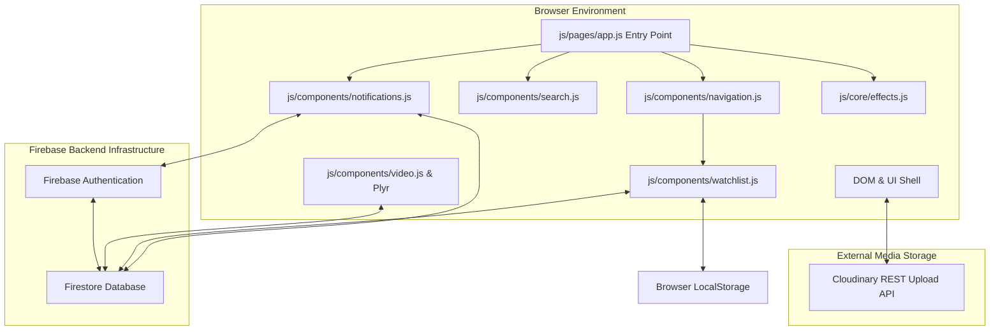
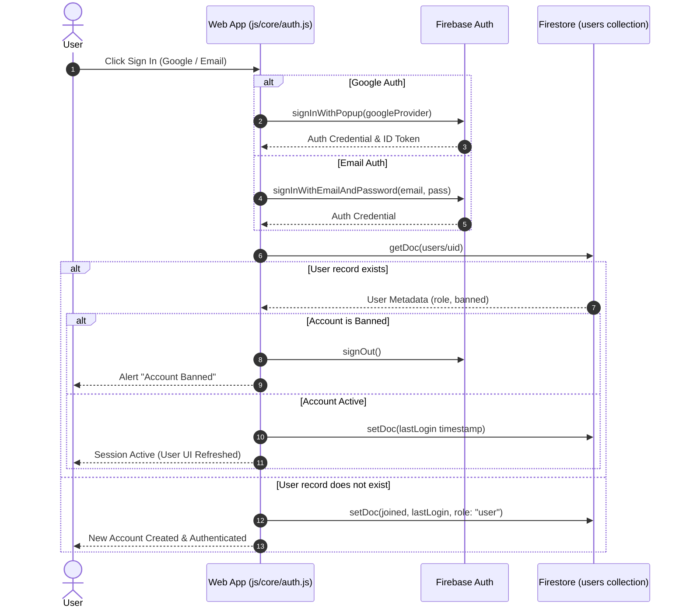
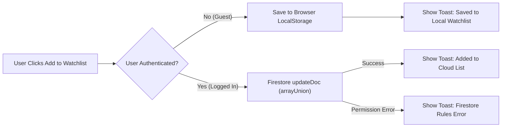
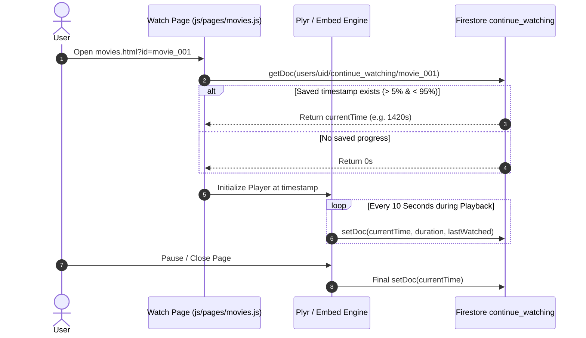
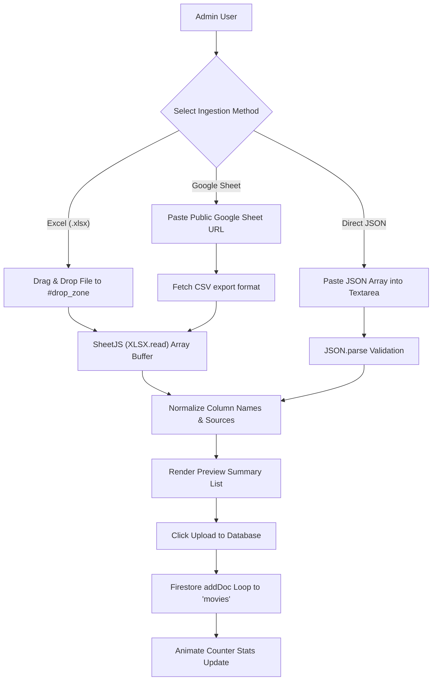

# 🎬 StreamX — Premium Video Streaming & Content Management Platform

<p align="left">
  <a href="https://streamx.madesh.in/"></a>
  
  
  
  
  
</p>

StreamX is a lightweight, zero-framework, production-ready video streaming and web management application. Built entirely with Vanilla HTML5, CSS3 Glassmorphism design system, and ES6 JavaScript Modules, StreamX delivers a fluid, Netflix-grade streaming experience powered by a Firebase Firestore backend, real-time auth, multi-language audio source management, interactive media playback, and an administrative bulk-ingestion engine.


---

## Table of Contents

- [Project Overview](#project-overview)
- [Why StreamX Was Built](#why-streamx-was-built)
- [Key Features](#key-features)
- [Screenshots](#screenshots)
- [Live Demo](#live-demo)
- [Tech Stack](#tech-stack)
- [Architecture Overview](#architecture-overview)
- [Folder Structure](#folder-structure)
- [System Workflows](#system-workflows)
  - [Authentication Flow](#authentication-flow)
  - [Firestore Data Schemas](#firestore-data-schemas)
  - [Watchlist Dual-Sync Engine](#watchlist-dual-sync-engine)
  - [Smart Media Player & Progress Resume](#smart-media-player--progress-resume)
  - [Admin Dashboard & Content Ingestion](#admin-dashboard--content-ingestion)
  - [Real-Time Notification System](#real-time-notification-system)
  - [Cloudinary Profile Image Integration](#cloudinary-profile-image-integration)
- [Installation & Setup](#installation--setup)
  - [Prerequisites](#prerequisites)
  - [Firebase Configuration](#firebase-configuration)
  - [Running Locally](#running-locally)
- [Project Architecture & Component Breakdown](#project-architecture--component-breakdown)
  - [CSS Modular System](#css-modular-system)
  - [JavaScript Core Modules](#javascript-core-modules)
- [Performance Optimizations](#performance-optimizations)
- [Accessibility (A11y)](#accessibility-a11y)
- [Responsive Design Support](#responsive-design-support)
- [Known Limitations](#known-limitations)
- [Future Improvements](#future-improvements)
- [Contributing](#contributing)
- [License](#license)
- [Author & Contact](#author--contact)

---

## Project Overview

StreamX provides an immersive web portal for discovering, searching, managing, and watching movies and TV series. The application operates as a single-page application (SPA) shell on the home interface while maintaining clean multi-page sub-routes for content viewing (`/pages/movies.html`), profile customization (`/pages/profile.html`), authentication (`/pages/auth.html`), and administration (`/pages/admin.html`).

Unlike typical client-heavy web applications that rely on heavy frontend frameworks, StreamX demonstrates how high-end aesthetic fidelity, sub-millisecond DOM manipulation, state synchronization, and complex administrative operations can be achieved using native browser APIs and lightweight cloud microservices.

---

## Why StreamX Was Built

1. **Demonstrate Native Web Capabilities**: Modern browsers offer powerful features such as CSS Glassmorphism, CSS Custom Properties, IntersectionObserver, requestAnimationFrame, and ES Modules. StreamX leverages these without external JS framework runtime overhead.
2. **Solve Content Delivery Bottlenecks**: Streamers require unified support for multiple stream backends—including direct MP4 files, external embeds (YouTube, Google Drive, JioCloud), and multi-audio language tracks. StreamX unifies these into a single player interface.
3. **Dual Storage Offline & Cloud Resilience**: Guests can manage watchlists locally via `localStorage` without forced login barriers. Once authenticated, data automatically merges with cloud Firestore documents.
4. **Streamlined Bulk Ingestion**: Admin management of streaming catalogs can be tedious. StreamX features client-side Excel (`.xlsx`), Google Sheets CSV, and direct JSON parsing engines for instantaneous mass uploads.

---

## Key Features

- **Hero Banner & Motion Showcase**: Interactive showcase featuring dynamic background backdrops, star ratings, genres, and parallax scrolling.
- **Multi-Source Video Player**: Customized Plyr HTML5 video player with automatic failover to embedded iframe players for Google Drive and YouTube links.
- **Multi-Language Audio & Episode Drawer**: Native audio language switcher and episode drawer supporting multi-track series streams.
- **Playback Progress Tracking**: Automatic 10-second interval timestamp tracking saving progress to Firestore, enabling users to resume content across sessions.
- **Dual Watchlist Synchronization**: Instant guest watchlist saving via `localStorage` merged with user Firestore cloud storage upon sign-in.
- **Debounced Live Search & Filtering**: Fast client-side search with 250ms debouncing across titles, release years, and genres.
- **Real-Time Notification System**: Live Firestore `onSnapshot` notification listener with unread badge indicators and batch "Mark All Read" actions.
- **Admin Command Center**:
  - Live metric card counter animations (Total Movies, Total Users, Estimated Storage).
  - Bulk ingestion via Excel drag-and-drop, public Google Sheet CSV URL, or raw JSON arrays.
  - Series Builder tool for visual Season and Episode data entry with per-episode language sources.
  - User management suite for role updates (User/Admin), account banning, direct notifications, and account deletion.
- **Profile Customization**: Live avatar cropping using CropperJS and direct multi-part image uploads to Cloudinary API.

---

## Screenshots

| Home & Feature Showcase | Custom Video Player & Drawer |
| :---: | :---: |
|  |  |
| *StreamX Home Showcase with Hero Backdrop & Movies Row* | *Smart Player with Multi-Language Control & Episode Drawer* |

| Admin Command Center & Ingestion | User Profile & Activity Log |
| :---: | :---: |
|  |  |
| *Bulk Excel/Google Sheets Content Ingestion Dashboard* | *Profile Editor with CropperJS Modal & Cloudinary Sync* |

---

## 🚀 Live Demo & Deployment

> [!IMPORTANT]
> 🌐 **Live Application**: [https://streamx.madesh.in/](https://streamx.madesh.in/)  
> 💻 **GitHub Repository**: [https://github.com/Shiva134-ui/StreamX](https://github.com/Shiva134-ui/StreamX)  
> *StreamX is deployed live on a custom domain with zero-configuration static serving, delivering instant page loads and full Firebase & Cloudinary cloud feature support.*


---

## Tech Stack

### Core Technologies
- **HTML5**: Semantic document structure with standard ARIA accessibility attributes.
- **CSS3**: Vanilla CSS design system using CSS Variables, Flexbox, Grid, Glassmorphism, and Fluid Typography (`clamp()`).
- **JavaScript (ES6+)**: Modular Native JavaScript Modules (`type="module"`) without transpiler or bundling toolchain.

### Backend & Cloud Services
- **Firebase Auth v9**: Google OAuth Popup & Email/Password Authentication.
- **Firebase Firestore v9**: Real-time Document Database for catalogs, user profiles, watchlists, progress, and notifications.
- **Cloudinary REST API**: Direct image asset hosting for user profile photos.

### Third-Party Libraries (CDN Loaded)
- **Plyr.js (v3.7.8)**: Accessible HTML5 Media Player UI.
- **Cropper.js (v1.5.13)**: Client-side interactive image canvas cropper.
- **SheetJS / XLSX**: Client-side Excel `.xlsx` spreadsheet and CSV parsing.
- **Bootstrap Icons (v1.11.1)** & **Font Awesome (v6.7.1)**: Vector icon system.
- **Outfit Font**: Google Web Font.

---

## Architecture Overview

StreamX follows a decoupled component-oriented architecture. Core utilities manage authentication state, visual effects, and toast notifications. Feature modules encapsulate UI state, data queries, and event handlers.



---

## Folder Structure

```
StreamX-main/
├── assets/
│   ├── data/
│   │   ├── firestore.rules        # Security rules for Firestore collections
│   │   ├── movie.csv              # Standard CSV import template
│   │   └── movie.json             # Local fallback content catalog
│   └── img/
│       ├── IMDb-icon.png
│       ├── fav-icon.png
│       ├── favicon.png
│       ├── logo.png
│       ├── p-6.jpg
│       └── user.jpg
├── css/
│   ├── core/
│   │   ├── effects.css            # Animation keyframes & GPU utility classes
│   │   ├── layout.css             # Design tokens, global reset, grid, buttons
│   │   └── variables.css          # Design tokens & CSS custom properties
│   └── pages/
│       ├── admin.css              # Dashboard stats, tables & form layout
│       ├── auth.css               # Auth container glassmorphism & input styling
│       ├── home.css               # Hero section, gradient overlays & row styling
│       ├── movies.css             # Player layout, episode drawer & toolbar
│       └── profile.css            # Profile header, tab controls & modal styles
├── js/
│   ├── admin/
│   │   ├── parsers.js             # XLSX, CSV, and JSON data translation engine
│   │   ├── ui.js                  # Table rendering, users list & Series Builder
│   │   └── utils.js               # Admin helper utilities
│   ├── components/
│   │   ├── cleanup.js             # Watchlist anomaly cleanup tasks
│   │   ├── navigation.js          # SPA view switcher & grid filters
│   │   ├── notifications.js       # Firestore real-time notification listener
│   │   ├── search.js              # Debounced search bar controller
│   │   ├── ui.js                  # User profile header & auth modal helpers
│   │   ├── video.js               # Embed URL transformer & Plyr initializer
│   │   └── watchlist.js           # Dual LocalStorage + Firestore watchlist sync
│   ├── core/
│   │   ├── auth.js                # Firebase Auth wrapper (Google, Email, Role)
│   │   ├── effects.js             # rAF Parallax, 3D card tilt & IntersectionObserver
│   │   ├── firebase-config.js     # Firebase app initialization & SDK exports
│   │   └── toast.js               # Toast notification system
│   └── pages/
│       ├── admin.js               # Admin dashboard controller & stat counter
│       ├── app.js                 # Global main entry point for home SPA shell
│       ├── auth.js                # Dedicated Sign-In / Sign-Up page handler
│       ├── home.js                # Hero showcase & popular movies catalog renderer
│       ├── login.js               # Auth helper placeholder
│       ├── movies.js              # Watch page, Plyr player & progress tracker
│       └── profile.js             # Profile management, CropperJS & Cloudinary sync
├── pages/
│   ├── admin.html                 # Content administration command center
│   ├── auth.html                  # Standalone authentication page
│   ├── movies.html                # Media player and recommendation page
│   └── profile.html               # User profile & watchlist management page
├── index.html                     # Primary SPA application entry point
└── README.md                      # Project documentation
```

---

## System Workflows

### Authentication Flow

StreamX supports both Google OAuth Popup authentication and standard Email/Password authentication. User roles (`user` or `admin`) and ban statuses are enforced via Firestore user records.



---

### Firestore Data Schemas

#### Collection: `movies/{movieId}`
```json
{
  "id": "movie_001",
  "name": "Interstellar",
  "genre": "Sci-Fi, Adventure",
  "year": "2014",
  "rating": "8.7",
  "description": "A team of explorers travel through a wormhole in space...",
  "sposter": "https://image.url/small_poster.jpg",
  "bposter": "https://image.url/backdrop.jpg",
  "url": "https://stream.url/video.mp4",
  "downloadUrl": "https://download.url/video.mp4",
  "size": 2.5,
  "type": "movie",
  "sources": [
    { "lang": "English", "url": "https://stream.url/en.mp4", "download": "https://dl.url/en.mp4" },
    { "lang": "Spanish", "url": "https://stream.url/es.mp4", "download": "https://dl.url/es.mp4" }
  ]
}
```

#### Series Entry Structure (with Seasons Map):
```json
{
  "name": "Stranger Things",
  "type": "series",
  "seasons": {
    "Season 1": [
      {
        "title": "Chapter One: The Vanishing of Will Byers",
        "duration": "48m",
        "size": 1.2,
        "sources": [
          { "lang": "English", "url": "https://stream.url/s1e1.mp4", "download": "" }
        ]
      }
    ]
  }
}
```

#### Collection: `users/{uid}`
```json
{
  "name": "Alex Mercer",
  "email": "alex@example.com",
  "photo": "https://res.cloudinary.com/demo/image/upload/v1/user.jpg",
  "joined": "2026-01-15T10:30:00.000Z",
  "lastLogin": "2026-07-24T17:00:00.000Z",
  "role": "user",
  "banned": false,
  "watchlist": [
    {
      "id": "movie_001",
      "name": "Interstellar",
      "sposter": "https://image.url/small_poster.jpg",
      "date": "2014",
      "genre": "Sci-Fi"
    }
  ]
}
```

#### Sub-collection: `users/{uid}/notifications/{notificationId}`
```json
{
  "message": "Welcome to StreamX Premium!",
  "date": "2026-07-24T12:00:00.000Z",
  "read": false,
  "type": "admin"
}
```

#### Sub-collection: `users/{uid}/continue_watching/{movieId}`
```json
{
  "movieId": "movie_001",
  "name": "Interstellar",
  "poster": "https://image.url/small_poster.jpg",
  "currentTime": 1420.5,
  "duration": 5040.0,
  "lastWatched": "2026-07-24T17:10:00.000Z"
}
```

---

### Watchlist Dual-Sync Engine

StreamX provides seamless watchlist management for both unregistered guests and logged-in users.



---

### Smart Media Player & Progress Resume



---

### Admin Dashboard & Content Ingestion



---

### Real-Time Notification System

- **Listener**: Initialized on user login via `onSnapshot` listening to `users/{uid}/notifications` ordered by `date desc`.
- **Badge Indicator**: Automatically calculates unread count (`read == false`) and updates the top navigation badge counter (`#notif_badge`).
- **Batch Update**: "Mark all read" executes a Firestore `writeBatch` updating all unread notifications to `read: true`.

---

### Cloudinary Profile Image Integration

- Users can upload a custom profile picture by providing an image URL or selecting a local image file.
- When selecting a file, an interactive **Cropper.js** modal (`#crop_modal`) opens, enforcing a 1:1 square crop aspect ratio.
- Upon confirmation, the canvas exports a JPEG Blob and uploads directly to the **Cloudinary Upload API** endpoint (`https://api.cloudinary.com/v1_1/{cloud_name}/image/upload`).
- The resulting HTTPS URL is updated on the Firebase Auth user profile and the Firestore user document.

---

## Installation & Setup

### Prerequisites

- Modern Web Browser (Google Chrome, Microsoft Edge, Mozilla Firefox, Safari).
- Static HTTP Web Server (e.g., VS Code Live Server, Python HTTP server, `npx serve`, or Node.js `http-server`).
- Firebase Project with **Authentication** (Google & Email/Password enabled) and **Cloud Firestore Database**.

---

### Firebase Configuration

Create or update the configuration file at `js/core/firebase-config.js`:

```javascript
import { initializeApp } from "https://www.gstatic.com/firebasejs/9.22.0/firebase-app.js";
import { getAuth } from "https://www.gstatic.com/firebasejs/9.22.0/firebase-auth.js";
import { getFirestore } from "https://www.gstatic.com/firebasejs/9.22.0/firebase-firestore.js";

const firebaseConfig = {
    apiKey: "YOUR_FIREBASE_API_KEY",
    authDomain: "YOUR_PROJECT.firebaseapp.com",
    databaseURL: "https://YOUR_PROJECT.firebaseio.com",
    projectId: "YOUR_PROJECT_ID",
    storageBucket: "YOUR_PROJECT.firebasestorage.app",
    messagingSenderId: "YOUR_SENDER_ID",
    appId: "YOUR_APP_ID"
};

const app = initializeApp(firebaseConfig);
const auth = getAuth(app);
const db = getFirestore(app);

export { auth, db };
```

#### Firestore Security Rules (`assets/data/firestore.rules`)
```javascript
rules_version = '2';
service cloud.firestore {
  match /databases/{database}/documents {
    match /movies/{movieId} {
      allow read: if true;
      allow write: if request.auth != null && 
        (request.auth.token.email == 'sivamadesh.134@gmail.com' || 
         get(/databases/$(database)/documents/users/$(request.auth.uid)).data.role == 'admin');
    }
    match /users/{userId} {
      allow read, write: if request.auth != null;
      match /notifications/{notifId} {
        allow read, write: if request.auth != null;
      }
      match /continue_watching/{movieId} {
        allow read, write: if request.auth != null;
      }
    }
  }
}
```

---

### Running Locally

Since StreamX uses native ES6 JavaScript Modules (`type="module"`), files must be served over `http://` or `https://` protocols (not `file://`).

#### Option 1: Python HTTP Server
```bash
# Navigate to project directory
cd StreamX-main

# Python 3
python -m http.server 8000
```
Open your browser to `http://localhost:8000`.

#### Option 2: Node.js `npx serve`
```bash
# Serve current directory
npx serve .
```
Open the generated local URL (e.g. `http://localhost:3000`).

#### Option 3: VS Code Live Server Extension
- Right-click `index.html` in VS Code and select **Open with Live Server**.

---

## Project Architecture & Component Breakdown

### CSS Modular System

- **`css/core/variables.css`**: Central design tokens defining dark mode colors (`--bg-body`, `--bg-surface`), Netflix accent red (`--primary`), fluid typography scaling (`clamp()`), z-index stacking layers, and custom easing curves.
- **`css/core/effects.css`**: Hardware-accelerated GPU animation utility classes (`will-change`, `transform: translate3d`) and master scrollbar styles.
- **`css/core/layout.css`**: Global CSS reset, flexbox/grid containers, buttons (`.btn-primary`, `.btn-glass`, `.btn-playing`), navigation header, mobile drawer sidebar, and modal base.
- **`css/pages/*.css`**: Page-specific styling modules (`admin.css`, `home.css`, `movies.css`, `profile.css`, `auth.css`).

---

### JavaScript Core Modules

| Module Path | Primary Responsibility |
| :--- | :--- |
| `js/pages/app.js` | Main SPA initializer for home view, navigation, search, and global Auth state monitoring. |
| `js/core/auth.js` | Firebase Auth helper methods (`loginWithGoogle`, `registerWithEmail`, `loginWithEmail`, `logoutUser`, `onUserChange`). |
| `js/core/effects.js` | Performance-optimized visual effects: IntersectionObserver scroll reveal, rAF hero parallax, and 3D tilt. |
| `js/core/toast.js` | Fixed floating toast notification manager with auto-dismissal. |
| `js/components/navigation.js` | View switcher (`home`, `movies`, `series`, `watchlist`) and live category grid filtering. |
| `js/components/search.js` | 250ms debounced live search controller handling header dropdown results and grid filtering. |
| `js/components/video.js` | Embed URL transformer (Google Drive, YouTube) and Plyr player initializer. |
| `js/components/watchlist.js` | Dual storage watchlist manager merging LocalStorage and Firestore cloud lists. |
| `js/components/notifications.js` | Real-time Firestore notification listener, badge counter, and batch update handlers. |
| `js/admin/parsers.js` | Data mapping and conversion engine for `.xlsx`, Google Sheets CSV, and JSON data. |
| `js/admin/ui.js` | Admin table views, user management cards, and interactive Series Builder interface. |
| `js/pages/admin.js` | Admin panel controller, animated metric counters, and CRUD operation handlers. |
| `js/pages/movies.js` | Watch page player, progress saver (`continue_watching`), multi-audio selector, and recommended grid. |
| `js/pages/profile.js` | User profile management, CropperJS canvas controller, and Cloudinary upload handler. |

---

## Performance Optimizations

1. **`requestAnimationFrame` Throttling**: Scroll parallax and 3D card tilt handlers execute strictly within browser frame render cycles (`rAF`), eliminating layout thrashing.
2. **Passive Event Listeners**: Touch and scroll event listeners use `{ passive: true }`, ensuring main-thread scrolling is never blocked.
3. **Debounced User Input**: Search inputs are debounced by 250ms, preventing excessive DOM filtering and query execution.
4. **Lazy Loading Assets**: All poster images feature `loading="lazy"` and `decoding="async"` to optimize initial page loads.
5. **GPU Hardware Acceleration**: Animated CSS classes utilize `will-change: transform, opacity` for hardware layer promotion.

---

## Accessibility (A11y)

- **Semantic HTML5**: Elements use standard tags (`<main>`, `<aside>`, `<header>`, `<nav>`, `<section>`).
- **ARIA Roles & States**: Dynamic widgets incorporate `role="button"`, `role="dialog"`, `role="listbox"`, `aria-expanded`, `aria-label`, and `aria-controls`.
- **Keyboard Navigation**: Interactive elements include `tabindex="0"` with `Enter` and `Space` key event handling.
- **Color Contrast**: Text elements maintain high-contrast ratios against dark surface backgrounds.

---

## Responsive Design Support

StreamX is fully responsive and tested across all standard viewport breakpoints:

| Viewport Width | Layout Adaptations |
| :--- | :--- |
| **320px – 375px** (Mobile Extra Small) | Compact header, 2-column card grid, floating bottom navigation bar. |
| **425px** (Mobile Medium) | Horizontal scrollable admin metrics row, full-screen overlay drawers. |
| **768px** (Tablet) | Off-canvas sliding mobile sidebar drawer, responsive table card views. |
| **1024px** (Desktop Small) | Icon-and-text sidebar navigation, active 3D card tilt & parallax effects. |
| **1440px+** (Desktop Large) | Centered 1400px maximum layout container, multi-column grid layout. |

---

## Known Limitations

1. **Direct Video Hosting**: StreamX relies on external video stream URLs (direct MP4/HLS links, YouTube embeds, or Google Drive previews). It does not perform server-side video transcoding or HLS segmenting.
2. **Third-Party Embed Restrictions**: Certain video links hosted on Google Drive or YouTube may be restricted by strict HTTP header policies (`X-Frame-Options` or CORS settings) set by the provider.

---

## Future Improvements

- [ ] **HLS / DASH Native Playback**: Integrate `hls.js` for adaptive bitrate streaming of `.m3u8` playlists.
- [ ] **PWA (Progressive Web App) Support**: Add a Web App Manifest and Service Worker for offline app caching.
- [ ] **User Ratings & Reviews**: Allow authenticated users to leave star ratings and textual reviews on title pages.
- [ ] **Enhanced Watch History**: Dedicated page detailing full playback timeline history across devices.

---

## Contributing

Contributions are welcome! Please follow these guidelines:

1. Fork the repository.
2. Create a feature branch (`git checkout -b feature/AmazingFeature`).
3. Commit your changes (`git commit -m 'Add some AmazingFeature'`).
4. Push to the branch (`git push origin feature/AmazingFeature`).
5. Open a Pull Request.

Please ensure code formatting conforms to standard ES6 module style and pure CSS guidelines.

---

## License

Distributed under the **MIT License**. See `LICENSE` for more information.

---

## Author & Contact

**Madesh S**  
*Senior Frontend & Cloud Engineer*  
- **Live Platform**: [streamx.madesh.in](https://streamx.madesh.in/)
- **Email**: `sivamadesh.134@gmail.com`
- **GitHub**: [github.com/Shiva134-ui](https://github.com/Shiva134-ui)
- **Project Repo**: [github.com/Shiva134-ui/StreamX](https://github.com/Shiva134-ui/StreamX)


