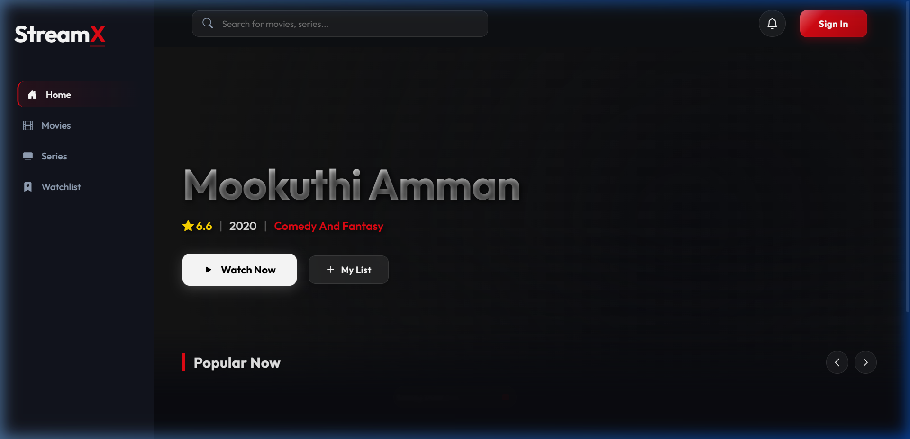
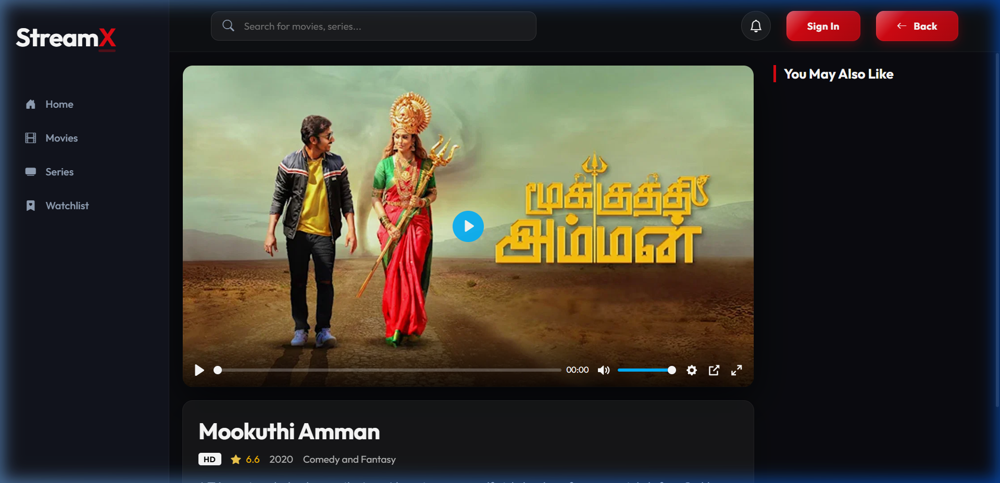
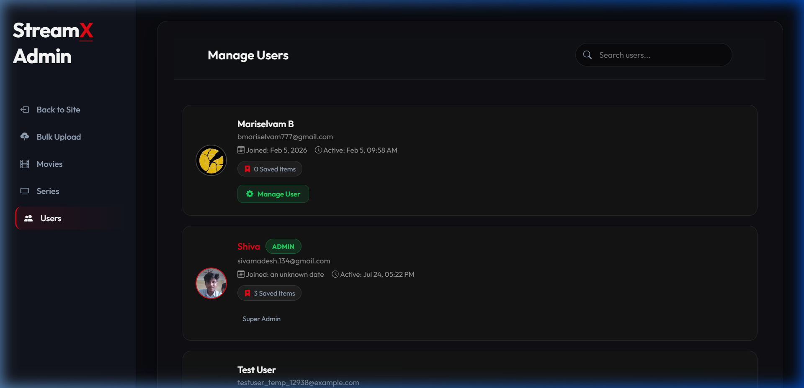
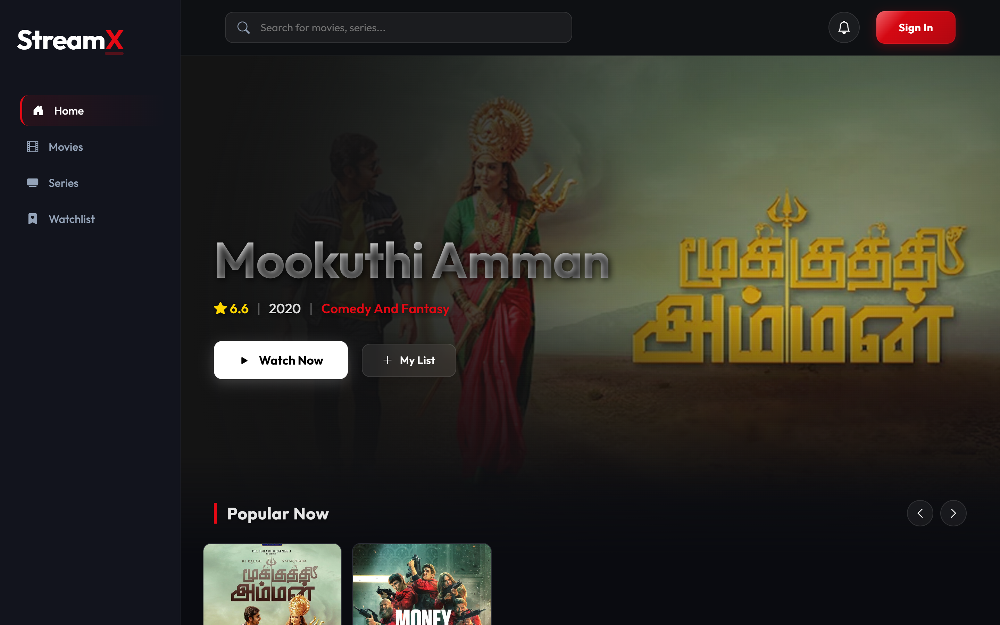

# 🎬 StreamX

> Modern Video Streaming Platform built with Vanilla JavaScript & Firebase.

<p align="center">
  
</p>

<p align="center">
  <a href="https://your-demo-link.com">🌐 Live Demo</a> •
  <a href="https://github.com/Shiva134-ui/StreamX">📂 Repository</a> •
  <a href="#features">✨ Features</a>
</p>

---

## ✨ Features

- 🔐 Firebase Authentication
- 🎥 Multi-source Video Player
- ❤️ Watchlist Synchronization
- ⏱ Continue Watching
- 🔎 Live Search & Filters
- 👤 User Profiles
- 🛠 Admin Dashboard
- 📊 Bulk Movie Upload (Excel / JSON)
- 📱 Fully Responsive UI

---

## 🛠 Tech Stack

| Frontend | Backend | Services |
|----------|----------|----------|
| HTML5 | Firebase Auth | Firestore |
| CSS3 | JavaScript (ES6) | Cloudinary |

---

## 📸 Screenshots

| Home | Player |
|------|--------|
|  |  |

| Admin | Profile |
|------|---------|
|  |  |

---

## 🚀 Getting Started

```bash
git clone https://github.com/Shiva134-ui/StreamX.git
cd StreamX
```

Run using:

- VS Code Live Server
- Python HTTP Server
- `npx serve`

---

## 📁 Project Structure

```
StreamX/
├── assets/
├── css/
├── js/
├── pages/
└── index.html
```

---

## 🌟 Highlights

- Pure Vanilla JavaScript
- Zero Framework
- Glassmorphism UI
- Firebase Backend
- Modular Architecture
- Responsive Design

---

## 📄 License

MIT License

---

## 👨‍💻 Author

**Madesh S**

🌐 Portfolio: https://madesh.in

💻 GitHub: https://github.com/Shiva134-ui

⭐ If you like this project, consider giving it a star.
